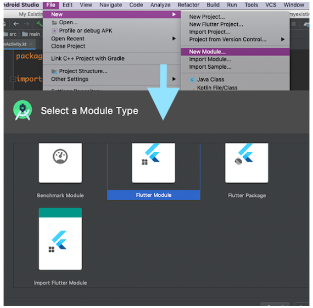
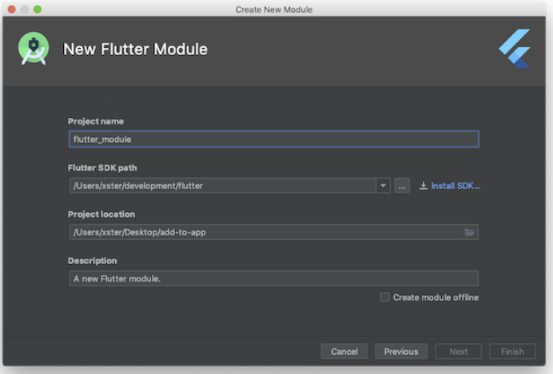
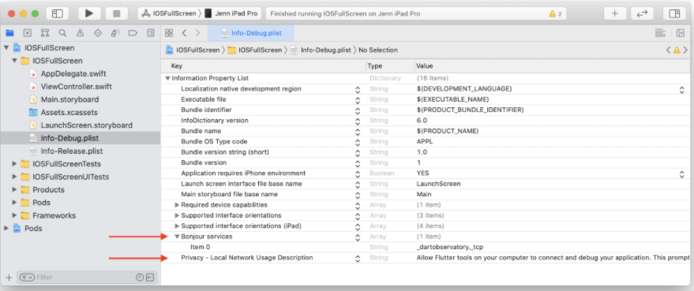
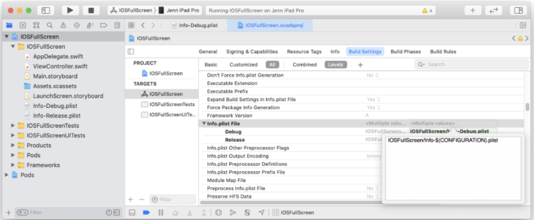
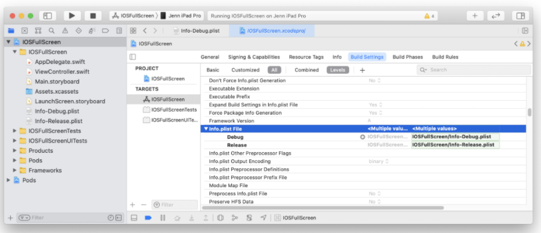

# Add to App
## Flutter to Android

- config in app/build.gradle (Flutter currently only supports building ahead-of-time (AOT) compiled libraries for x86_64, armeabi-v7a and arm64-v8a)
```dart
android {
  //...
  defaultConfig {
    ndk {
      // Filter for architectures supported by Flutter.
      abiFilters 'armeabi-v7a', 'arm64-v8a', 'x86_64'
    }
  }
}
```

```dart
dependencies {
  implementation project(':flutter')
}
```
- Check Java 8 requirement

```dart
android {
  //...
  compileOptions {
    sourceCompatibility 1.8
    targetCompatibility 1.8
  }
}
```

- Create Flutter module
  - Use Android Studio
  - File > New > New Module
  
  
  
  - Next
  
  
  
- Use Flutter Activity
  - Declare in Manifest
  ```dart
  <activity
  android:name="io.flutter.embedding.android.FlutterActivity"
  android:theme="@style/LaunchTheme"
  android:configChanges="orientation|keyboardHidden|keyboard|screenSize|locale|layoutDirection|fontScale|screenLayout|density|uiMode"
  android:hardwareAccelerated="true"
  android:windowSoftInputMode="adjustResize"
  />
  ```
  - Start Flutter Activity
  ```dart
  myButton.setOnClickListener {
    startActivity(
      FlutterActivity.createDefaultIntent(this)
    )
  }
  ```
  - Start Flutter Activity with Route
  ```dart
  myButton.setOnClickListener {
    startActivity(
      FlutterActivity
        .withNewEngine()
        .initialRoute("/my_route")
        .build(this)
    )
  }
  ```
  In Flutter module
  ```dart
  // With Route
  void main() => runApp(chooseWidget(window.defaultRouteName));

  Widget chooseWidget(String route) {
    switch (route) {
      // name of the route defined in the host app
      case '/route_1':
        return MyApp();

      default:
        return MaterialApp(
          home: Scaffold(
            body: Center(
              child: Text('Unknown'),
            ),
          ),
        );
    }
  }
  ```
  - (Optional) Start Flutter Activity using a cached FlutterEngine
  
    - Create application
    
    ```dart
    class MyApplication : Application() {
      lateinit var flutterEngine : FlutterEngine

      override fun onCreate() {
        super.onCreate()

      // Instantiate a FlutterEngine.
      flutterEngine = FlutterEngine(this)

      // Start executing Dart code to pre-warm the FlutterEngine.
      flutterEngine.dartExecutor.executeDartEntrypoint(
        DartExecutor.DartEntrypoint.createDefault()
      )

      // Cache the FlutterEngine to be used by FlutterActivity.
      FlutterEngineCache
        .getInstance()
        .put("my_engine_id", flutterEngine)
      }
    }

    ```
    - Start Flutter Activity with Cached
    ```dart
    myButton.setOnClickListener {
      startActivity(
        FlutterActivity
          .withCachedEngine("my_engine_id")
          .build(this)
      )
    }
    ```
    - Initial route with a cached engine
    ```dart
    class MyApplication : Application() {
      lateinit var flutterEngine : FlutterEngine
      override fun onCreate() {
          super.onCreate()
        // Instantiate a FlutterEngine.
        flutterEngine = FlutterEngine(this)
        // Configure an initial route.
        flutterEngine.navigationChannel.initialRoute = "your/route/here";
        // Start executing Dart code to pre-warm the FlutterEngine.
        flutterEngine.dartExecutor.executeDartEntrypoint(
          DartExecutor.DartEntrypoint.createDefault()
        )
        // Cache the FlutterEngine to be used by FlutterActivity or FlutterFragment.
        FlutterEngineCache
          .getInstance()
          .put("my_engine_id", flutterEngine)
      }
    }

    ```
 - Use FlutterFragment
 
    - Create Activity to host FlutterFragment
    ```dart
    class MyActivity : FragmentActivity() {
      companion object {
        // Define a tag String to represent the FlutterFragment within this
        // Activity's FragmentManager. This value can be whatever you'd like.
        private const val TAG_FLUTTER_FRAGMENT = "flutter_fragment"
      }

      // Declare a local variable to reference the FlutterFragment so that you
      // can forward calls to it later.
      private var flutterFragment: FlutterFragment? = null

      override fun onCreate(savedInstanceState: Bundle?) {
        super.onCreate(savedInstanceState)

        // Inflate a layout that has a container for your FlutterFragment. For
        // this example, assume that a FrameLayout exists with an ID of
        // R.id.fragment_container.
        setContentView(R.layout.my_activity_layout)

        // Get a reference to the Activity's FragmentManager to add a new
        // FlutterFragment, or find an existing one.
        val fragmentManager: FragmentManager = supportFragmentManager

        // Attempt to find an existing FlutterFragment, in case this is not the
        // first time that onCreate() was run.
        flutterFragment = fragmentManager
          .findFragmentByTag(TAG_FLUTTER_FRAGMENT) as FlutterFragment?

        // Create and attach a FlutterFragment if one does not exist.
        if (flutterFragment == null) {
          var newFlutterFragment = FlutterFragment.createDefault()
          flutterFragment = newFlutterFragment
          fragmentManager
            .beginTransaction()
            .add(
              R.id.fragment_container,
                newFlutterFragment,
                TAG_FLUTTER_FRAGMENT
              )
              .commit()
          }
        }
      }
    ```
    
    ```dart
    val flutterFragment = FlutterFragment.withNewEngine()
    .initialRoute("myInitialRoute/")
    .build()
    ```
    
 ## Flutter to IOS
  - Create Flutter module
  ```dart
  cd some/path/
  flutter create --template module my_flutter
  ```
  - Create PodFile
  ```dart
  flutter_application_path = '../my_flutter'
  load File.join(flutter_application_path, '.ios', 'Flutter', 'podhelper.rb')
  target 'MyApp' do
    install_all_flutter_pods(flutter_application_path)
  end
  ```
  
  - Run pod install
  - Create FlutterEngine
  ```dart
  import UIKit
  import Flutter
  // Used to connect plugins (only if you have plugins with iOS platform code).
  import FlutterPluginRegistrant

  @UIApplicationMain
  class AppDelegate: FlutterAppDelegate { // More on the FlutterAppDelegate.
    lazy var flutterEngine = FlutterEngine(name: "my flutter engine")
  
    override func application(_ application: UIApplication, didFinishLaunchingWithOptions launchOptions: [UIApplication.LaunchOptionsKey: Any]?) -> Bool {
      // Runs the default Dart entrypoint with a default Flutter route.
      flutterEngine.run();
      // Used to connect plugins (only if you have plugins with iOS platform code).
      GeneratedPluginRegistrant.register(with: self.flutterEngine);
      return super.application(application, didFinishLaunchingWithOptions: launchOptions);
    }
  }
  ```
  - Show a FlutterViewController with your FlutterEngine
  ```dart
  import UIKit
  import Flutter

  class ViewController: UIViewController {
    override func viewDidLoad() {
      super.viewDidLoad()

      // Make a button to call the showFlutter function when pressed.
      let button = UIButton(type:UIButton.ButtonType.custom)
      button.addTarget(self, action: #selector(showFlutter), for: .touchUpInside)
      button.setTitle("Show Flutter!", for: UIControl.State.normal)
      button.frame = CGRect(x: 80.0, y: 210.0, width: 160.0, height: 40.0)
      button.backgroundColor = UIColor.blue
      self.view.addSubview(button)
    }

    @objc func showFlutter() {
      let flutterEngine = (UIApplication.shared.delegate as! AppDelegate).flutterEngine
      let flutterViewController =
          FlutterViewController(engine: flutterEngine, nibName: nil, bundle: nil)
      present(flutterViewController, animated: true, completion: nil)
    }
  }

  ```
  - Alternatively - Create a FlutterViewController with an implicit FlutterEngine
  ```dart
  // Existing code omitted.
  func showFlutter() {
    let flutterViewController = FlutterViewController(project: nil, nibName: nil, bundle: nil)
    present(flutterViewController, animated: true, completion: nil)
  }
  ```
  - Route
  ```dart
  let flutterEngine = FlutterEngine()
  // FlutterDefaultDartEntrypoint is the same as nil, which will run main().
  flutterEngine.run(withEntrypoint: FlutterDefaultDartEntrypoint, initialRoute: "/onboarding")
  ```
## Debugging
  - Start native project
  - Run flutter attach in flutter module
  - Config for IOS
    - On iOS 14 and higher, enable the Dart multicast DNS service in the Debug version of your app to add debugging functionalities such as hot-reload and DevTools via flutter attach.
    - Create Info-Debug.plist, Info-Release.plist
    - In Info-Debug.plist only add the key NSBonjourServices and set the value to an array with the string _dartobservatory._tcp. Note Xcode will display this as “Bonjour services”.
    - Optionally, add the key NSLocalNetworkUsageDescription set to your desired customized permission dialog text.
    

    - In your target’s build settings, change the Info.plist File (INFOPLIST_FILE) setting path from path/to/Info.plist to path/to/Info-$(CONFIGURATION).plist.
    
    - This will resolve to the path Info-Debug.plist in Debug and Info-Release.plist in Release.
    
    - Alternatively, you can explicitly set the Debug path to Info-Debug.plist and the Release path to Info-Release.plist.
